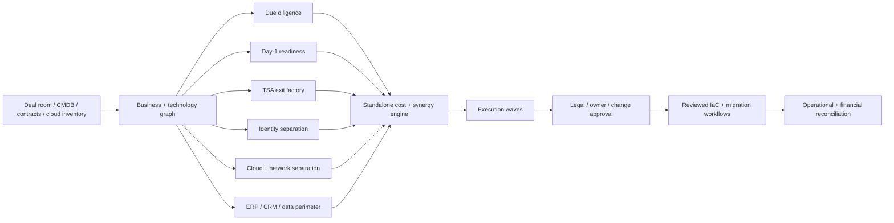

# m&a-technology-integration-factory

**M&A IT integration and carve-out execution: technology due diligence, Day-1 readiness, TSA exit, cloud and identity separation, deal economics and synergy realization.**

[](https://github.com/AAH20/m-and-a-technology-integration-factory/actions/workflows/ci.yml)
[](pyproject.toml)
[](LICENSE)

Technology can determine whether an acquisition or divestiture preserves revenue, exits transition services on schedule and realizes its investment thesis. This repository implements a deterministic transaction control plane spanning business capabilities, infrastructure, applications, identity, TSAs and deal economics.

> Evidence status: the engine, tests and international carve-out fixture are implemented. All organizations, costs, assets and findings are synthetic. Azure and production execution artifacts are contracts until exercised in an authorized environment.

## The transaction question

```text
Can NewCo operate independently on Day 1,
exit each TSA before penalties,
remove former-parent access,
and realize the deal synergy after fully loaded execution cost?
```

## Executable capabilities

- Validates asset dependencies and rejects missing assets and cycles.
- Builds execution waves across identity, network, ERP, CRM, data, cloud and operations.
- Scores Day-1 readiness and identifies blocked capabilities.
- Calculates critical asset blast radius.
- Forecasts TSA extensions, charges, penalties and blockers.
- Scores privileged, unowned and former-parent identity exposure.
- Calculates standalone run rate, one-time cost, three-year net value and synergy realization.
- Emits an explicitly simulated evidence receipt with a bounded SHA-256 integrity claim.

## Architecture



## Run the synthetic carve-out

```bash
python3 examples/generate_case.py
PYTHONPATH=src python3 -m unittest discover -s tests -v
PYTHONPATH=src python3 -m dealfactory.cli \
  examples/synthetic-international-carveout.json \
  --output evidence/synthetic-analysis.json
```

The fixture models 120 technology assets, 35 TSA services and 40 identity findings across UK/EU legal entities and ten workstreams.

## Current synthetic result

| KPI | Result |
|---|---:|
| Day-1 readiness | 88% |
| Day-1 blockers | 3 |
| Late TSA forecasts | 14 |
| Critical identity findings | 2 |
| Annual parent run cost | $7.2M |
| Standalone annual cost | $5.196M |
| Annual run-rate delta | $2.004M |
| TSA forecast cost | $6.887M |
| Total modeled one-time cost | $11.337M |
| Three-year net value | **-$5.325M** |
| Purchase-case synergy realization | 83.5% |

The negative result is deliberate: it demonstrates that delayed TSA exits can destroy an otherwise positive run-rate case. These values are scenario outputs—not a customer result, valuation opinion or investment recommendation.

## Decision boundaries

- LLMs may extract and propose; they cannot execute tenant, identity, data or network changes.
- Legal counsel determines the permitted data perimeter and retention obligations.
- Asset and business owners approve Day-1 readiness and acceptance criteria.
- Discovery and execution identities remain separate.
- Shared privileged access is not accepted merely because a TSA exists.
- Missing evidence becomes a blocker, never an invented fact.
- Digests do not prove deal-room completeness, identity, custody or non-repudiation.

## Delivery contracts

- [Azure separation foundation](infra/azure/main.bicep)
- [Day-1 and TSA policy gates](policy/transaction-gates.json)
- [Architecture and trust model](docs/architecture.md)
- [Deal economics](docs/unit-economics.md)
- [Synthetic assumptions](evidence/assumptions.md)

## Core KPIs

- Day-1 critical-capability readiness
- TSA exit forecast, monthly charges and extension exposure
- Standalone operating cost
- One-time integration or separation cost
- Synergy committed versus realized
- Identity migration and former-parent access closure
- Application consolidation and retirement
- Data-reconciliation accuracy
- Cutover, outage and rollback rates
- Revenue at risk
- RTO/RPO attainment
- Evidence completeness

## Search and role alignment

M&A IT integration, post-merger integration, IT carve-out, technology due diligence, TSA exit, Day 1 readiness, IT separation, cloud M&A, divestiture, private equity technology, standalone IT cost, synergy realization, ERP separation, identity migration, tenant-to-tenant migration, Azure landing zone, cybersecurity due diligence and data separation.

## Engage

Planning an acquisition, divestiture, carve-out or TSA exit?

[Request a technology transaction architecture review](https://a2zsoc.com/contact?topic=ma-technology-integration&utm_source=github&utm_medium=repository).

